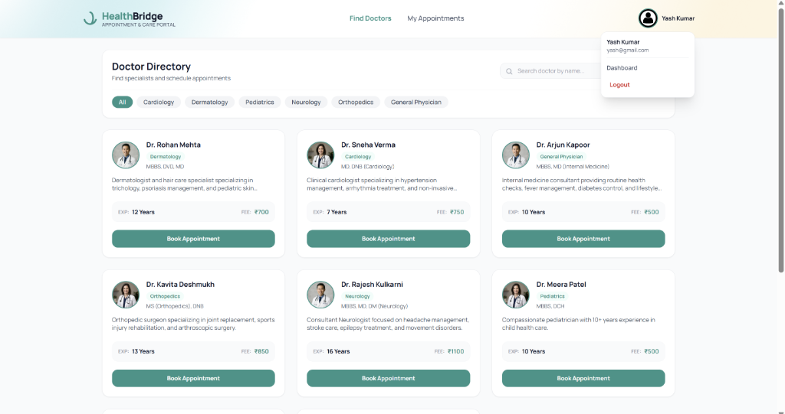
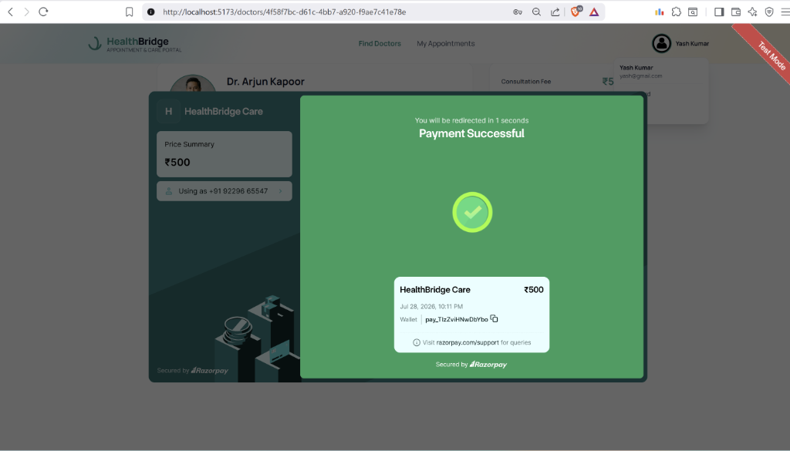
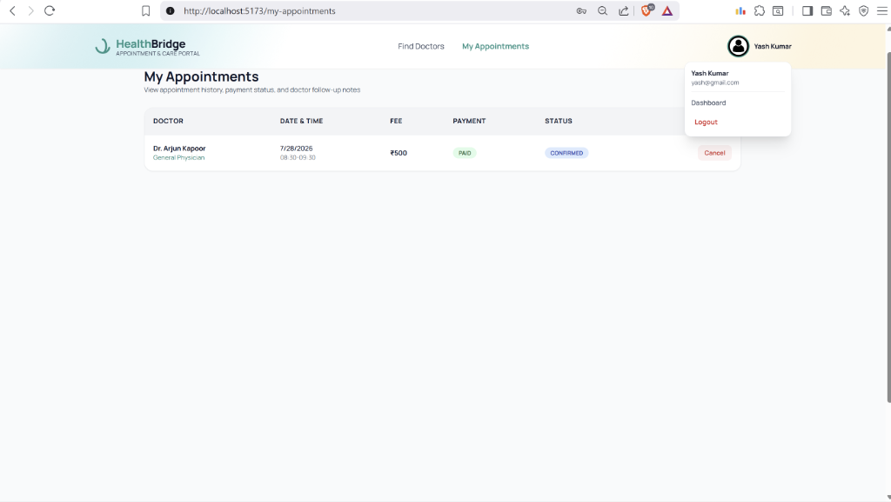

# 🏥 HealthBridge

> A secure healthcare appointment booking platform featuring JWT authentication, Razorpay payment integration, transaction-safe booking, PostgreSQL concurrency protection, and role-based access control.

> **Primary Objective**: Secure Appointment Booking with Online Payment and Follow-up Management.

HealthBridge is a full-stack, single-objective healthcare web application built using **React 18 (Vite), Node.js, Express.js, PostgreSQL (Neon Serverless), Prisma ORM, and Razorpay Payments**.

---

## 📸 Application Preview & Visual Flow

### 1. Doctor Directory & Search Page
Filter specialist doctors by clinical category (Cardiology, Dermatology, Pediatrics, Neurology, Orthopedics, General Physician) with unified local doctor profiles and real-time name search.



---

### 2. Instant Razorpay Payment Modal
Secure online checkout powered by Razorpay SDK with HMAC-SHA256 signature verification and automatic payment status updates.



---

### 3. Patient Bookings & Follow-up Dashboard
Track appointment status (`CONFIRMED`, `PENDING`, `CANCELLED`), payment receipts (`PAID`, `REFUNDED`), and view clinical prescription notes written by assigned doctors.



---

## ❓ Problem Statement & Solution

### ❌ What fails in traditional healthcare apps?
1. **Double Bookings**: Two patients booking the exact same time slot at the same millisecond due to unhandled database race conditions.
2. **Payment Forgery**: Fake client-side payment confirmations when HMAC signatures aren't cross-checked with database order IDs.
3. **Slot Blocking**: Cancelled appointments permanently locking slots from being re-booked.
4. **IDOR Vulnerabilities**: Unprotected API routes allowing malicious users to cancel or reschedule other patients' appointments.

### ✅ How HealthBridge solves this:
* 🛡️ **Zero Double-Bookings**: Active slot checks (`PENDING`, `CONFIRMED`) combined with a native **PostgreSQL Partial Unique Index** `WHERE status IN ('PENDING', 'CONFIRMED')`.
* 🔓 **Instant Slot Unblocking**: Cancelling an appointment marks `status = 'CANCELLED'`, automatically freeing the time slot for other patients.
* 💳 **Cryptographic Payment Integrity**: HMAC-SHA256 signature verification + mandatory `appointmentId` cross-checking.
* ⚡ **Payment Idempotency**: DB `@unique` constraint on `Payment.appointmentId` catches parallel double-clicks and returns existing Razorpay orders safely.
* 🔒 **IDOR Security**: Strict middleware enforcing `appointment.patientId === req.userId` / `appointment.doctorId === req.doctorId` on every mutation.

---

## 🏗️ End-to-End System Execution Flow

```text
Patient
   │
   ▼
Login (JWT Auth)
   │
   ▼
Browse Doctors Directory
   │
   ▼
Select Available Time Slot
   │
   ▼
Validate Slot Availability
   │
   ▼
Prisma Atomic Transaction
   │
   ▼
Create Razorpay Payment Order (Idempotent)
   │
   ▼
Complete Online Payment
   │
   ▼
Server-side HMAC Signature Verification
   │
   ▼
Confirm Appointment Status
   │
   ▼
Create / Update Payment Record Ledger
   │
   ▼
Doctor Consultation
   │
   ▼
Clinical Prescription & Follow-up
```

---

## 🛠️ Tech Stack

| Layer | Technology Used | Purpose |
| :--- | :--- | :--- |
| **Frontend** | React 18 (Vite SPA) | Fast, responsive single-page web app |
| **Styling** | Tailwind CSS | Clean, modern healthcare UI design |
| **Backend** | Node.js + Express.js | REST API routing & authentication middleware |
| **Database** | PostgreSQL (Neon Serverless) | Serverless relational database storage |
| **ORM** | Prisma ORM v5 | Type-safe database queries & migration management |
| **Auth** | JWT (JSON Web Tokens) | Short-lived Access Token + HttpOnly Refresh Token |
| **Payments** | Razorpay Node SDK | Online checkout & HMAC signature verification |

---

## 🔒 Authentication System (Hybrid Security)

HealthBridge implements a production-grade **Hybrid Authentication Architecture**:

* **Access Token**: Short-lived (24h) returned in API responses and attached via `Authorization: Bearer <token>` header for stateless requests.
* **Refresh Token**: Long-lived (7d) stored in an **`HttpOnly` cookie** to insulate sessions against client-side XSS attacks.
* **SHA-256 Hashing**: Refresh tokens in PostgreSQL are stored as SHA-256 hashes (`crypto.createHash("sha256")`), preventing session hijacking if the database leaks.

---

## ⚡ Concurrency & Slot Protection

To prevent double-bookings without permanently blocking slots when appointments are cancelled:

1. **Active Slot Query Filter**:
   ```javascript
   const existing = await tx.appointment.findFirst({
     where: {
       doctorId,
       appointmentDate: date,
       timeSlot: slot,
       status: { in: ['PENDING', 'CONFIRMED'] },
     },
   });
   ```
2. **PostgreSQL Partial Unique Index**:
   ```sql
   CREATE UNIQUE INDEX doctor_active_appointment_slot_idx 
   ON "Appointment" ("doctorId", "appointmentDate", "timeSlot") 
   WHERE status IN ('PENDING', 'CONFIRMED');
   ```
3. **Slot Recovery**: When an appointment is `CANCELLED`, its status becomes `'CANCELLED'`. The partial index and active query filters ignore it, making the slot **immediately re-bookable**.

---

## 🗄️ Database Schema (6 Normalized Models)

```prisma
model User {
  id           String   @id @default(uuid())
  email        String   @unique
  passwordHash String
  role         String   // "PATIENT" | "DOCTOR"
  name         String
  phone        String?
  refreshToken String?
}

model DoctorProfile {
  id              String @id @default(uuid())
  userId          String @unique
  specialization String
  qualification  String?
  experienceYears Int
  consultationFee Float
  bio             String?
  photoUrl        String?
}

model Slot {
  id          String @id @default(uuid())
  doctorId    String
  dayOfWeek   String
  startTime   String
  endTime     String
  isAvailable Boolean @default(true)
}

model Appointment {
  id              String   @id @default(uuid())
  patientId       String
  doctorId        String
  appointmentDate DateTime
  timeSlot        String
  amount          Float
  status          String   @default("PENDING")   // PENDING | CONFIRMED | CANCELLED | COMPLETED
  paymentStatus   String   @default("PENDING")   // PENDING | PAID | FAILED | REFUNDED
}

model Payment {
  id                String  @id @default(uuid())
  appointmentId     String  @unique
  razorpayOrderId   String  @unique
  razorpayPaymentId String?
  razorpaySignature String?
  amount            Float
  status            String  @default("PENDING")
}

model FollowUp {
  id            String    @id @default(uuid())
  appointmentId String    @unique
  patientId     String
  doctorId      String
  notes         String
  prescription  Json?
  status        String    @default("ACTIVE")    // ACTIVE | INVALIDATED
}
```

---

## 📡 Key API Endpoints

### Auth (`/api/auth`)
* `POST /register` — Register Patient or Doctor account
* `POST /login` — Log in & receive Access Token + HttpOnly Cookie
* `POST /refresh-token` — Rotate Access & Refresh Tokens
* `GET /me` — Get current logged-in user profile

### Doctors (`/api/doctors`)
* `GET /` — Search doctors by name & filter by specialization
* `GET /:id` — Get doctor profile & available consultation slots
* `POST /slots` — Add available doctor time slots (Doctor only)
* `DELETE /slots/:slotId` — Delete consultation time slot (Doctor only)

### Appointments (`/api/appointments`)
* `POST /book` — Reserve an appointment slot
* `GET /my-appointments` — Get patient appointment & payment history
* `GET /doctor-appointments` — Get doctor consultation queue
* `PUT /cancel/:id` — Cancel appointment & trigger refund transition
* `PUT /reschedule/:id` — Reschedule appointment to a new date/slot
* `PATCH /status/:id` — Update consultation status (`CONFIRMED`, `COMPLETED`)

### Payments (`/api/payments`)
* `POST /create-order` — Create Razorpay order (Idempotent)
* `POST /verify` — HMAC-SHA256 signature verification & status update
* `POST /webhook` — Razorpay webhook event listener (`payment.captured`, `order.paid`)

### Follow-ups (`/api/followups`)
* `POST /create` — Save clinical notes & prescription (Doctor only)
* `GET /appointment/:appointmentId` — Fetch patient prescription notes

---

## 🚀 Quick Setup & Local Running

### 1. Clone & Backend Setup
```bash
cd Backend
npm install

# Configure environment variables in .env
cp .env.example .env

# Run Prisma schema push & seed doctor data
npx prisma db push
npm run seed

# Start backend API server
npm start
```

### 2. Frontend Setup
```bash
cd Frontend
npm install

# Start Vite dev server
npm run dev
```
Open [http://localhost:5173](http://localhost:5173) in your browser.

---

### 📄 License
This project is open source and available under the [MIT License](LICENSE).
